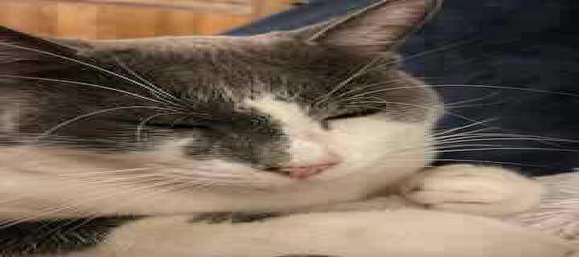
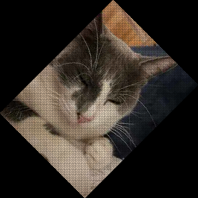
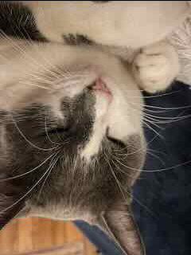
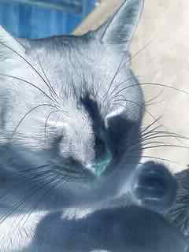
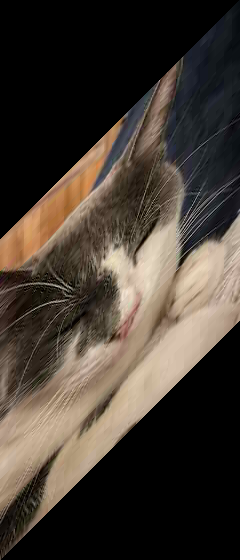

# FSU Linear Algebra Project
Apply linear transformations to BMP images in Rust with 0 dependencies!

This program applies a numebr of linear transaformations to `input.bmp` and
encodes the result in both SVG and BMP formats. The output images are
stored in the `transformed_images` directory.

## Project Structure
- `raster.rs` provides a format agnostic in-memory representation for raster images.
- `bmp.rs` provides routines for encoding/decoding `.bmp` files.
- `quilt.rs` provides a mechanism for transforming a raster image into
a quilt of parallelograms. Linear transformations can then be applied
to the vertex matrix of this quilt.
- `rasterize.rs` provides an rasterization algorithm for transforming
quilts into raster images.
- `svg.rs` provides a routine for encoding a quilt as an SVG file.
- `geom.rs` provides mathematical primitives, notably a euclidean distance function,
  and various arithmetic vector operations. These are used during rasterization.
- `main.rs` provides routines for applying a number of standard linear transformation,
  including the identity transformation, translation, rotation, scaling, stretching, etc.

## Bugs
- The `part2_translating.bmp` does not match `part2_translating.svg`. I believe
there is some edge case during rasterization which I am missing, and that this
edge case is causing the inconsistency. As of yet I do not see the issue. 

## Transformations
### Identity

### Scaling

### Rotating

### Reflecting

### Color Transfrom

### Stretching

